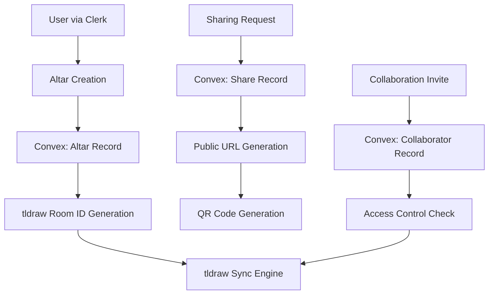

# Database Schema Design

## Overview

This design document outlines the Convex database schema for the Recuerdame collaborative digital altar application. The schema is designed to be minimal and efficient, leveraging Clerk for user management and tldraw's sync engine for canvas data storage. The focus is on altar metadata, sharing capabilities, and collaboration management.

## Architecture

### Core Principles

1. **Separation of Concerns**: Convex handles altar metadata and relationships, while tldraw manages canvas data
2. **Clerk Integration**: All user data is managed by Clerk; we only store Clerk user IDs as references
3. **Minimal Data Duplication**: Avoid storing data that can be derived or is managed by external services
4. **Scalable Sharing**: Support both private and public altar access with efficient querying
5. **Real-time Ready**: Schema supports real-time updates for collaboration features

### Data Flow



## Components and Interfaces

### Table: altars

The primary table storing altar metadata and configuration.

```typescript
altars: defineTable({
  // Basic altar information
  title: v.string(),
  description: v.optional(v.string()),

  // Ownership and creation
  ownerId: v.string(), // Clerk user ID
  createdAt: v.number(), // Unix timestamp
  updatedAt: v.number(), // Unix timestamp

  // tldraw integration
  roomId: v.string(), // Unique room ID for tldraw sync

  // Note: Public sharing is determined by existence of altar_shares record

  // Metadata
  tags: v.optional(v.array(v.string())), // For categorization/search
  culturalElements: v.optional(v.array(v.string())), // Traditional elements included
})
  .index("by_owner", ["ownerId"])
  .index("by_created_at", ["createdAt"]);
```

### Table: collaborators

Manages collaboration permissions and access control.

```typescript
collaborators: defineTable({
  altarId: v.id("altars"),
  userId: v.string(), // Clerk user ID

  // Permission levels
  role: v.union(v.literal("editor"), v.literal("viewer")),

  // Collaboration metadata
  invitedAt: v.number(), // Unix timestamp
  invitedBy: v.string(), // Clerk user ID of inviter
  joinedAt: v.optional(v.number()), // When they first accessed
  lastActiveAt: v.optional(v.number()), // Last interaction timestamp

  // Status
  status: v.union(
    v.literal("pending"),
    v.literal("active"),
    v.literal("removed")
  ),
})
  .index("by_altar", ["altarId"])
  .index("by_user", ["userId"])
  .index("by_altar_and_user", ["altarId", "userId"])
  .index("by_status", ["status"]);
```

### Table: altar_shares

Tracks public sharing instances with basic view metrics.

```typescript
altar_shares: defineTable({
  altarId: v.id("altars"),
  shareSlug: v.string(), // Same as altar.shareSlug for easy lookup

  // Sharing configuration
  shareType: v.union(v.literal("public_view"), v.literal("public_edit")),
  createdAt: v.number(),
  expiresAt: v.optional(v.number()), // Optional expiration

  // Analytics
  viewCount: v.number(),
  lastViewedAt: v.optional(v.number()),

  // QR Code data
  qrCodeGenerated: v.boolean(),
  qrCodeData: v.optional(v.string()), // Base64 encoded QR code or URL to stored image
})
  .index("by_altar", ["altarId"])
  .index("by_slug", ["shareSlug"])
  .index("by_created_at", ["createdAt"]);
```

## Data Models

### Altar Model

```typescript
interface Altar {
  _id: Id<"altars">;
  title: string;
  description?: string;
  ownerId: string; // Clerk user ID
  createdAt: number;
  updatedAt: number;
  roomId: string;
  tags?: string[];
  culturalElements?: string[];
}
```

### Collaborator Model

```typescript
interface Collaborator {
  _id: Id<"collaborators">;
  altarId: Id<"altars">;
  userId: string; // Clerk user ID
  role: "editor" | "viewer";
  invitedAt: number;
  invitedBy: string; // Clerk user ID
  joinedAt?: number;
  lastActiveAt?: number;
  status: "pending" | "active" | "removed";
}
```

### Share Model

```typescript
interface AltarShare {
  _id: Id<"altar_shares">;
  altarId: Id<"altars">;
  shareSlug: string;
  shareType: "public_view" | "public_edit";
  createdAt: number;
  expiresAt?: number;
  viewCount: number;
  lastViewedAt?: number;
  qrCodeGenerated: boolean;
  qrCodeData?: string;
}
```

## Error Handling

### Data Integrity

1. **Orphaned Records**: Implement cleanup functions for when altars are deleted
2. **Invalid User References**: Handle cases where Clerk user IDs become invalid
3. **Duplicate Collaborators**: Prevent duplicate collaborator entries with unique constraints
4. **Share Slug Conflicts**: Ensure share slugs are globally unique

### Access Control

1. **Permission Validation**: Always verify user permissions before data access
2. **Expired Shares**: Handle expired public shares gracefully
3. **Removed Collaborators**: Immediately revoke access for removed collaborators
4. **Owner Transfer**: Support transferring altar ownership

### tldraw Integration

1. **Room ID Conflicts**: Ensure tldraw room IDs are globally unique
2. **Sync Failures**: Handle cases where tldraw sync is unavailable
3. **Canvas Data Loss**: Maintain altar metadata even if canvas data is lost

## Migration Strategy

### Initial Schema Deployment

1. Create all tables with proper indexes
2. Set up initial data validation rules
3. Configure real-time subscriptions

### Future Schema Changes

1. Use Convex migration system for schema updates
2. Maintain backward compatibility for client applications
3. Plan for data migration scripts when needed

### Legacy Data Handling

1. Support importing existing altar data if needed
2. Handle migration from other storage systems
3. Preserve historical sharing data during migrations
